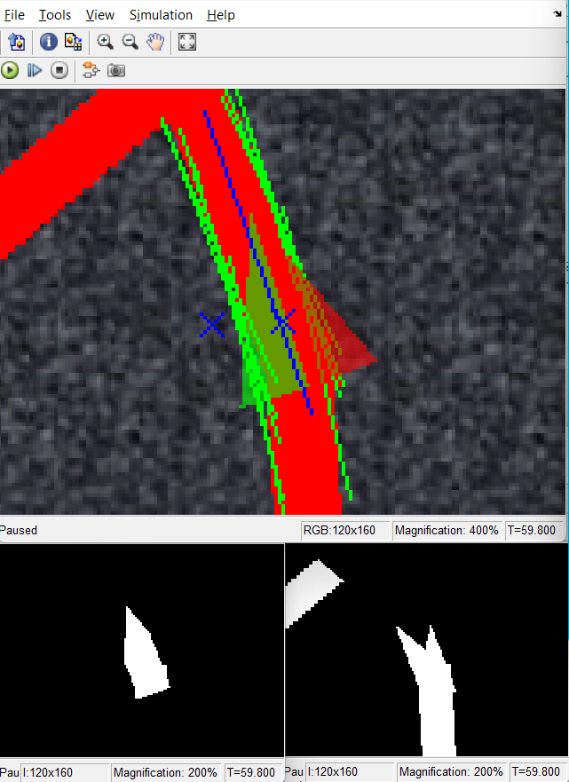
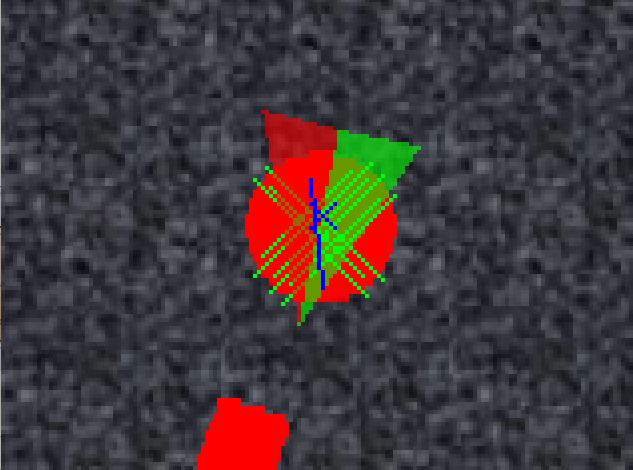
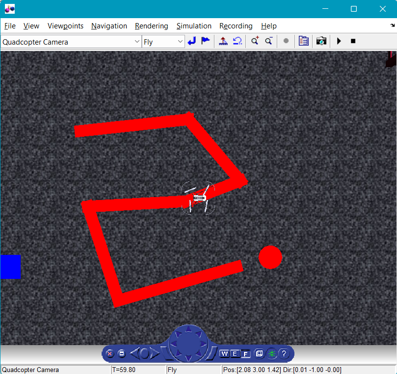

# Simulation of Line Follower Drone

Development of line follower algorithm based on Parrot mini drone for MathWorks Minidrone Competitions. Simulation is done using Simulink MATLAB.
In the given environment, line to be followed is red in colour and has a circle at the ending of red line for landing. Camera on drone is utilised to detect the lines and circle.
The algorithm is based on two ideas
 
1) 
The live image is processed and edges are detected using canny filter. Then Houghes line transform is done to extract the boundary of the red line. Houghe line transform will result in multiple lines(green lines) so we take first 2 lines and find mean of its coordinates. The new coordinates will give a line(blue) which is in middle of the red line. This line will give the heading of drone and asists the drone to remain the middle of the red line. However this methodology will fail in certain scenarios like when approaching a turn. This happens since we only consider the first two lines in Houghes matrix. Occasionally it gets confused with the heading since the blue line give two heading with difference of 180°. This method lacks the memory of previous heading information which is rectified in next method.

2) 
In this method we utilise the bitmap of the red line during image processing. We create 2 region of intrest in triangular shape at the centre of image. The orientation of the triangles depends on the previous heading information. We find the amount of intersection between bitmap of red line and both the regions of intrest(ROI). This value assist in decision of next heading. There are 2 X-marks which are the mean of bitmaps of red line and the intersection of ROI. These X-marks help in stability of flight.

MATLAB inbuild function `imfindcircles()` is used to find the center of circle for determination of the landing coordinates. Landing is done when the center of circle is inside the ROI. This check is performed to avoid unnecessary landing desions.

  
  
  

